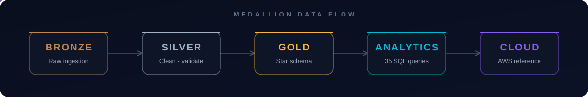
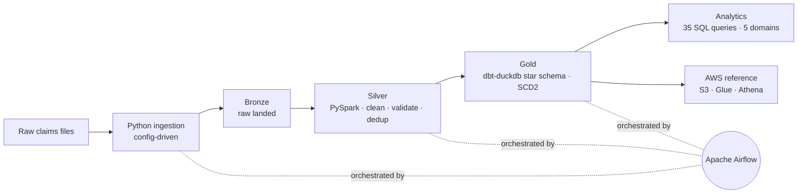

<!-- ====================== HERO ====================== -->

 

### I build the data platforms that turn raw, messy source systems into trustworthy, analytics-ready products.

 

&nbsp;

&nbsp;

&nbsp;

<!-- ====================== FEATURED PROJECT ====================== -->

<kbd>&nbsp;FEATURED PROJECT&nbsp;</kbd>

# ClaimsLake

**Healthcare Claims Data Engineering Platform**

An end-to-end, production-style pipeline that carries synthetic healthcare claims through a
**Bronze → Silver → Gold** medallion architecture — ingested with Python, transformed in PySpark,
modeled in dbt, orchestrated with Airflow, and reproducible locally with Docker Compose.

 

  

 

> **Engineering highlights** &nbsp;·&nbsp; Config-driven ingestion &nbsp;·&nbsp; PySpark cleaning with an explicit **quarantine path** (never silent drops) &nbsp;·&nbsp; **SCD Type 2** provider history &nbsp;·&nbsp; dbt-duckdb star schema &nbsp;·&nbsp; a curated analytical SQL layer &nbsp;·&nbsp; a path-filtered Terraform validation workflow.

|  |  |  |  |
|:--|:--|:--|:--|
| **17** PySpark tests passed | **dbt PASS = 14** | **35** analytical SQL queries | **5** SQL domains |
| Docker Compose verified locally | MinIO + PostgreSQL healthy | Airflow webserver + scheduler running | Four-job GitHub Actions CI |

_Terraform AWS reference architecture — CI-validated, never deployed. Synthetic data only; no real patient, member, or provider records._

 

### [&nbsp;Explore ClaimsLake&nbsp; →](https://github.com/Gundabathina/claimslake)

<!-- ====================== ARCHITECTURE (native) ====================== -->

<kbd>&nbsp;ARCHITECTURE&nbsp;</kbd>

### How the data moves

<!-- ====================== ENGINEERING PHILOSOPHY ====================== -->

<kbd>&nbsp;ENGINEERING PHILOSOPHY&nbsp;</kbd>

### Principles the work is built on

<table>
<tr>
<td align="center" width="20%"> <b>Reliable Systems</b> Retries, alerting, reproducible runs  </td>
<td align="center" width="20%"> <b>Automation First</b> Orchestrated pipelines, not manual steps  </td>
<td align="center" width="20%"> <b>Data Quality</b> Validate &amp; quarantine, never silently drop  </td>
<td align="center" width="20%"> <b>Infrastructure as Code</b> Versioned, reviewed, CI-validated  </td>
<td align="center" width="20%"> <b>Scalable Design</b> Batch &amp; streaming, cloud-native  </td>
</tr>
</table>

<!-- ====================== CURRENT FOCUS ====================== -->

<kbd>&nbsp;CURRENT FOCUS&nbsp;</kbd>

### What I'm building right now

<table>
<tr>
<td width="33%" align="center"> <b>Healthcare Data Platforms</b> HIPAA-aware claims &amp; member pipelines  </td>
<td width="33%" align="center"> <b>Cloud Data Engineering</b> Snowflake · Redshift · AWS · Airflow · dbt  </td>
<td width="33%" align="center"> <b>Production ETL</b> Batch &amp; streaming, built to run unattended  </td>
</tr>
<tr>
<td width="33%" align="center"> <b>Data Quality</b> Validation, quarantine, testable transforms  </td>
<td width="33%" align="center"> <b>GenAI-ready Data Pipelines</b> LangChain · OpenAI · embeddings · RAG  </td>
<td width="33%" align="center"> <b>Infrastructure as Code</b> Terraform reference architectures  </td>
</tr>
</table>

<!-- ====================== SELECTED PROJECTS ====================== -->

<kbd>&nbsp;SELECTED PROJECTS&nbsp;</kbd>

### Selected work

<table>
<tr>
<td width="50%" valign="top">

#### [ClaimsLake →](https://github.com/Gundabathina/claimslake)
End-to-end healthcare claims platform on a Bronze → Gold medallion architecture. Python · PySpark · dbt · Airflow · Docker.

</td>
<td width="50%" valign="top">

#### [Portfolio →](https://github.com/Gundabathina/prem-portfolio)
Data engineering portfolio site — React · TypeScript · Vite · Tailwind. Live at prem-portfolio-nu.vercel.app.

</td>
</tr>
<tr>
<td width="50%" valign="top">

#### [Healthcare Analytics →](https://github.com/Gundabathina/Healthcare-Data-Analysis-Using-Python)
Exploratory analysis of patient appointment no-show data. Python · Pandas · Matplotlib · Seaborn.

</td>
<td width="50%" valign="top">

#### [Medical Cost Forecasting →](https://github.com/Gundabathina/Medical-Cost-Analysis-and-Forecasting)
Forecasting medical insurance costs with EDA, linear &amp; polynomial regression. Python · scikit-learn.

</td>
</tr>
<tr>
<td width="50%" valign="top">

#### [Tesla Stock Analysis →](https://github.com/Gundabathina/Tesla-Stock-Price-Analysis-and-Prediction-Using-Python)
Stock price analysis &amp; prediction with technical indicators and ARIMA. Python · statsmodels.

</td>
<td width="50%" valign="top">

#### [More on GitHub →](https://github.com/Gundabathina?tab=repositories)
Additional analytics and data projects across healthcare, finance, and public datasets.

</td>
</tr>
</table>

<!-- ====================== TECH STACK ====================== -->

<kbd>&nbsp;TECHNOLOGY STACK&nbsp;</kbd>

### The tools I work with

 

**Languages**

**Cloud**

**Data Engineering**

**Databases &amp; Warehousing**

**Analytics &amp; BI**

**DevOps**

<!-- ====================== CONTACT ====================== -->

<kbd>&nbsp;CONTACT&nbsp;</kbd>

### Let's build reliable data systems.

Open to Data Engineer and AI/ML platform roles &nbsp;·&nbsp; Dallas–Fort Worth, Texas

 

&nbsp;

&nbsp;

