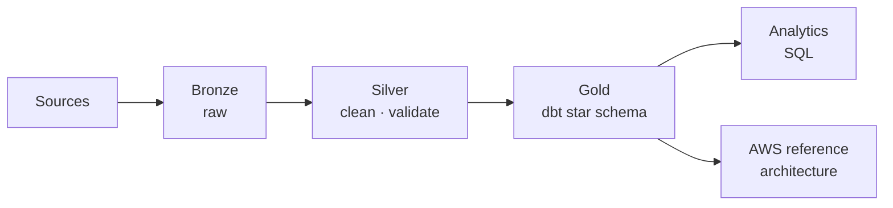

# Prem Teja Gundabathina

### Data Engineer

I build the data platforms that turn raw, messy source systems into trustworthy, analytics-ready products.

&nbsp;&nbsp;&nbsp;

## Featured · ClaimsLake

A healthcare claims data platform that carries synthetic claims through a Bronze → Silver → Gold medallion architecture — ingested in Python, cleaned and validated in PySpark, modeled in dbt, orchestrated with Airflow, and fully reproducible with Docker Compose.

**Stack**&nbsp;&nbsp;·&nbsp;&nbsp;`Python` `PySpark` `dbt` `Airflow` `DuckDB` `Docker` `Terraform` `GitHub Actions`

**Verified**&nbsp;&nbsp;·&nbsp;&nbsp;17 PySpark tests passing · dbt PASS = 14 · 35 analytical SQL queries across 5 domains · four-job GitHub Actions CI · Docker Compose verified locally · Terraform AWS reference architecture (CI-validated, never deployed) · synthetic data only

**Engineering capability demonstrated**&nbsp;&nbsp;·&nbsp;&nbsp;end-to-end medallion pipeline design, automated data-quality validation, tested transformations, and reproducible infrastructure.

[**Explore ClaimsLake →**](https://github.com/Gundabathina/claimslake)

### Architecture

## Selected Projects

| Project | Summary | Tech | Links |
|:--|:--|:--|:--|
| **ClaimsLake** | Healthcare claims platform on a Bronze → Gold medallion architecture. | `PySpark` `dbt` `Airflow` | [Repo](https://github.com/Gundabathina/claimslake) |
| **Portfolio** | Data engineering portfolio site. | `React` `TypeScript` | [Repo](https://github.com/Gundabathina/prem-portfolio) · [Live](https://prem-portfolio-nu.vercel.app) |
| **Healthcare Analytics** | Exploratory analysis of patient appointment no-show data. | `Python` `Pandas` | [Repo](https://github.com/Gundabathina/Healthcare-Data-Analysis-Using-Python) |
| **Medical Cost Forecasting** | Forecasting insurance costs with EDA and regression. | `scikit-learn` | [Repo](https://github.com/Gundabathina/Medical-Cost-Analysis-and-Forecasting) |

## Core Stack

| | |
|:--|:--|
| **Languages** | `Python` · `SQL` |
| **Data Engineering** | `PySpark` · `Spark` · `Airflow` · `dbt` |
| **Cloud & Infrastructure** | `AWS` · `Docker` · `Terraform` · `GitHub Actions` |
| **Databases** | `Snowflake` · `PostgreSQL` · `DuckDB` |

## Contact

[Portfolio](https://prem-portfolio-nu.vercel.app)&nbsp;&nbsp;·&nbsp;&nbsp;[LinkedIn](https://www.linkedin.com/in/prem-teja-21856a28b/)&nbsp;&nbsp;·&nbsp;&nbsp;[Email](mailto:premteja.data@gmail.com)&nbsp;&nbsp;·&nbsp;&nbsp;Dallas–Fort Worth, Texas
